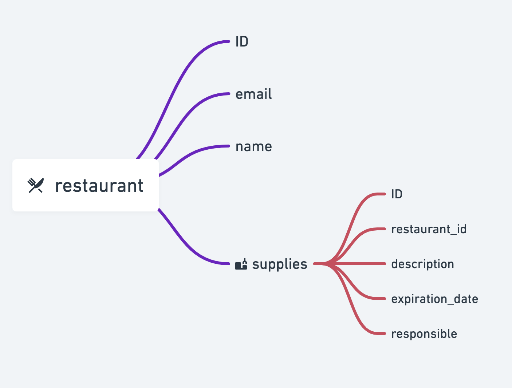

# Ims

Requirements to start your Phoenix server:

* Run docker postgres image: 
  
    `docker run --name postgres -e POSTGRES_PASSWORD=postgres -p 5432:5432 -d postgres`

* Connect to DB using config/config.exs and docker settings:
  
  `mix ecto.create`
  
* Install dependencies with: 
  
    `mix deps.get`
  
* Create and migrate your database with: 
  
    `mix ecto.setup`
  
* Start Phoenix endpoint with: 
  
    `mix phx.server`

* Basic DB Design:

Now you can visit [`localhost:4000`](http://localhost:4000) from your browser.

Ready to run in production? Please [check our deployment guides](https://hexdocs.pm/phoenix/deployment.html).

## Learn more

  * Official website: https://www.phoenixframework.org/
  * Guides: https://hexdocs.pm/phoenix/overview.html
  * Docs: https://hexdocs.pm/phoenix
  * Forum: https://elixirforum.com/c/phoenix-forum
  * Source: https://github.com/phoenixframework/phoenix
